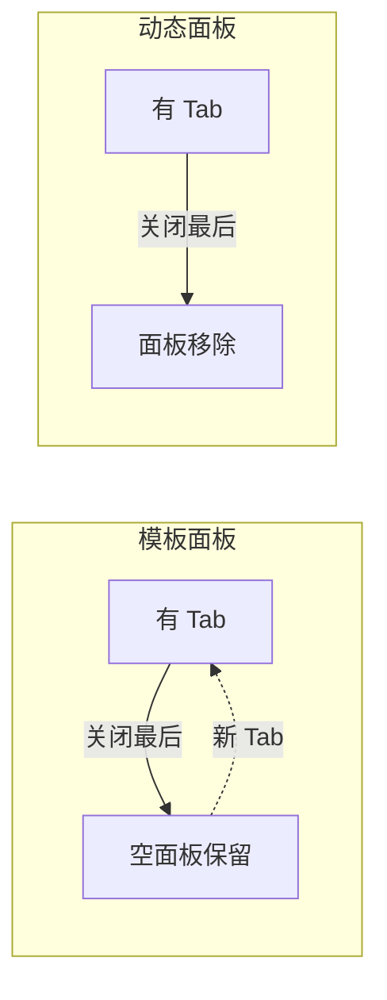

# SRS 空间概念图模板

在 §1.7 中用可靠的方式展示三种容器（Editor Tab / Dock Panel / ToolBar Entry）的位置关系。

## 首选方案：纯 ASCII 框图

最可靠，任何 markdown 预览器都能正常显示：

```text
  ┌── LT ──┬── Left Dock ──┬── Editor Area ──┬── Right Dock ─┬── RT ──┐
  │        │               │                  │              │        │
  │ 条目   │  ┌─────────┐  │  Tab1 │ Tab2 │ Tab3  │  ┌─────────┐  │ 条目   │
  │ (高亮) │  │Dock Panel│  │  ──────────────  │  │Dock Panel│  │        │
  │        │  │(工具窗口) │  │  标签页内容区域  │  │(工具窗口) │  │        │
  │        │  ├─────────┤  │                  │  │          │  │        │
  │        │  │更多面板  │  │                  │  │          │  │        │
  │        │  │可堆叠    │  │                  │  │          │  │        │
  └────────┴──┴─────────┴──┴──────────────────┴──┴──────────┴──┴────────┘
   ↑                        ↑                                     ↑
   ToolBar Entry            Editor Tab                         ToolBar Entry
   1:1对应Dock Panel        横向排列·点击/Ctrl+Tab切换          1:1对应Dock Panel
   点击切换面板             溢出·去重·固定·分屏                   点击切换面板
   面板移动时迁移                                              面板移动时迁移
```

## SVG 方案（仅当需要颜色编码时）

⚠️ VS Code markdown 预览要求：
- **每行必须以 `> ` 开头**（blockquote 包装）
- 禁止 CSS 中使用 `rx`（用内联属性）
- 避免 Unicode 特殊符号
- `stroke-dasharray` 必须配 `stroke-width`

## Mermaid 方案（流向/对比图）

对比图用 `flowchart` 比 `block-beta` 更可靠：



## 已知失败的方案

| 方案 | 症状 | 原因 |
|------|------|------|
| SVG 不包 blockquote | 空白 | VS Code 不识别 |
| SVG CSS 中写 `rx:2` | 空白 | 非标准 CSS 属性 |
| Mermaid `block-beta` | 布局混乱 | VS Code 对该类型支持不稳定 |
| SVG 含 `✕` 字符 | 动态面板区域空白 | Unicode 渲染失败 |
